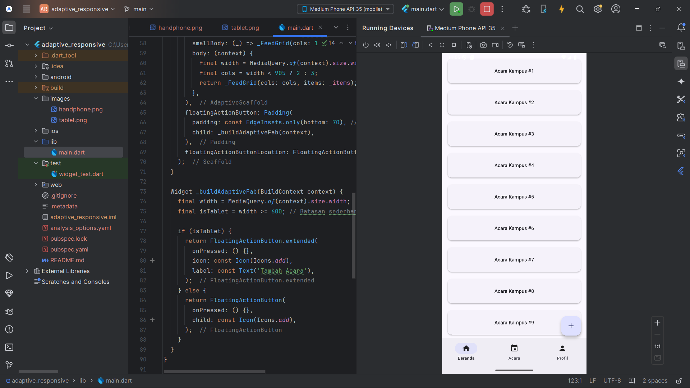

# Aplikasi Flutter 3 Halaman - Kelompok 8 
# Siti Intan Nia - 4522210054

## Deskripsi Aplikasi:
Aplikasi ini merupakan implementasi dasar dari penggunaan flutter_adaptive_scaffold untuk membuat aplikasi Flutter yang responsif dan dapat menyesuaikan tampilan secara optimal di berbagai ukuran layar seperti perangkat mobile, tablet, dan desktop.

## Screenshot tampilan:
### tampilan handphone

### tampilan tablet

## Penjelasan Tiap tampilan:
- **tampilan handphone: Pada perangkat berlayar kecil seperti smartphone, tombol-tombol disusun secara vertikal dalam bentuk daftar. 
    Susunan ini menjaga tampilan tetap rapi, mudah di-scroll, dan nyaman diakses pada layar terbatas. 
    Pada tampilan handphone, FAB berupa ikon bulat kecil di pojok kanan bawah.
    FAB hanya menampilkan ikon "+" untuk menambah acara baru, menjaga tampilan tetap simpel di layar kecil** 

- **tampilan tablet: Pada perangkat dengan layar yang lebih besar seperti tablet (tablet.png), tombol-tombol ditampilkan dalam format grid dengan beberapa kolom. 
  Penataan ini memaksimalkan penggunaan ruang layar sehingga membuat interaksi pengguna lebih efisien dan tampilan lebih seimbang. 
  Pada tampilan tablet, FAB secara otomatis berubah menjadi FAB extended (memanjang), menampilkan ikon dan label teks ("Tambah Acara"). 
  Karena ukuran layar lebih lebar, penggunaan teks tambahan membuat fitur lebih informatif dan tetap nyaman diakses.** 

  